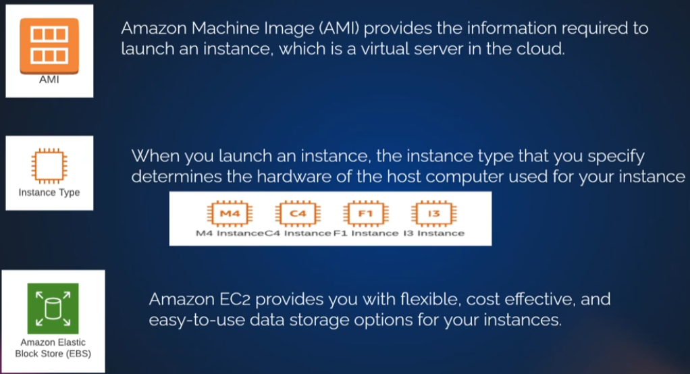
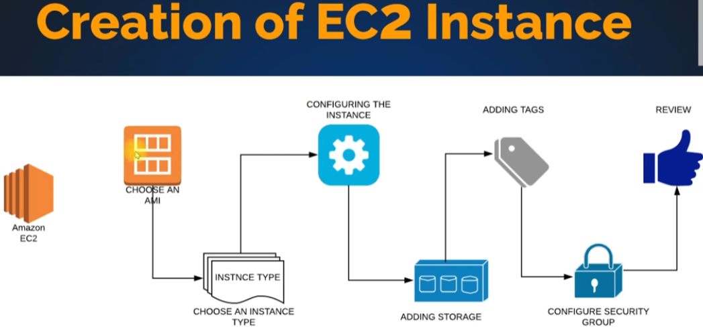

- [Ec2](#ec2)
- [User Input](#user-input)

# EC2

Amazon ECS (Elastic Container Service) is a fully managed container orchestration service provided by Amazon Web Services (AWS). It allows you to run, stop, and manage Docker containers on a cluster of EC2 instances. 

## Pricing
1. On demand (pay per hour)
2. Reserved (Reserve capacity, 1 or 3 yrs with a discount)
3. Spot (bid your price for unused ec2 capacity)
4. Dedicated Hosts (Physical server dedicated for you)

## Components

- AMI (Amazon Machine image)
Provides the info required to launch an instance (virtual server in the cloud)

- Instance type (Size, memory, cpu, ram, network speed, storage) 
When launcing, the type you specify determines the hardware of the host computer used for your instance.

- EBS (Amazons Elastic Block Store)
Provides you with flexible, cost effective & easy to use data storage for your instances.
Its the virtual hard disk on wich you can store your operating system.

## Tag
Tags are simple label consisting of a customer defined key and an optional value that can make it easier to manage, search for and filter resources.

## Security Group
Acts as a virtual firewall that controlls the traffic for one or more instances

## Log in 
Amazon EC2 uses public-key crytopgraphy to encripty and decrypt login information
Create - Download

- Linux: Use key for SSH
- Windows: Use key to generate password  

