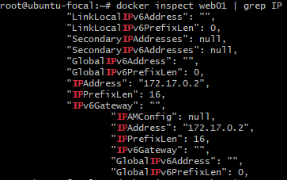
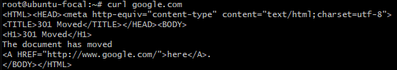
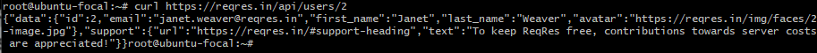
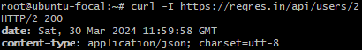
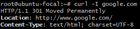

# Table of Contents

- [Docker](#docker)
- [Setup](#setup)
- [VM](#inside-the-vm)
- [Curl](#curl)
- [TCP / UDP](#tcp--udp)
- [Port Communication](#port-communication)


# Docker
- Docker: Docker is a platform that allows you to package and distribute applications as lightweight, portable, and isolated self-sufficient containers.


- Docker Hub: Docker Hub is a cloud-based registry service provided by Docker. It serves as a centralized repository for Docker images, allowing developers to share, distribute, and collaborate on containerized applications. Users can pull images from Docker Hub to their local environment or push their custom images to share with others.


- Container: A container is a runtime instance of a Docker image. It provides a lightweight, portable, and isolated environment for running applications. Containers share the host OS kernel, but each container has its own filesystem, processes, and network interfaces, ensuring isolation and consistency across different environments.


- Image: An image is a read-only template that contains the application's code, runtime, libraries, and dependencies. It's the blueprint for creating Docker containers. Images are portable and can be shared and reused across different environments.


- Difference between VM and Docker
  - VM: Virtual machines run on a hypervisor and require a guest OS for each VM, which consumes more resources and takes longer to start.  
  
  - Portability: Docker images are generally more portable and lightweight compared to VM images because they only contain the application's dependencies and not an entire OS.
  
  - Overhead: Docker containers have lower overhead(additional resoures such as memory, disk space, and CPU usage) compared to VMs because they share the host OS kernel, while VMs require separate guest OS instances. 

  - Isolation: Containers provide process-level isolation, meaning that processes running inside one container are isolated from processes in other containers and the host system.
    VMs provide hardware-level isolation, meaning the isolation of entire virtualized environments, including the OS, hardware resources, and kernel.
    

# Setup
```bash
get the local vagrant file,

config.vm.provision "shell", inline: <<-SHELL
   sudo apt-get update
sudo apt-get install \
    ca-certificates \
    curl \
    gnupg -y

sudo install -m 0755 -d /etc/apt/keyrings
curl -fsSL https://download.docker.com/linux/ubuntu/gpg | sudo gpg --dearmor -o /etc/apt/keyrings/docker.gpg
sudo chmod a+r /etc/apt/keyrings/docker.gpg
echo \
  "deb [arch="$(dpkg --print-architecture)" signed-by=/etc/apt/keyrings/docker.gpg] https://download.docker.com/linux/ubuntu \
  "$(. /etc/os-release && echo "$VERSION_CODENAME")" stable" | \
  sudo tee /etc/apt/sources.list.d/docker.list > /dev/null
sudo apt-get update
sudo apt-get install docker-ce docker-ce-cli containerd.io docker-buildx-plugin docker-compose-plugin -y
   SHELL
end
then run
vagrant up
```

## Inside the VM

```bash
systemctl status docker # check the status of docker
docker --version # check the version of docker
docker run hello-world # run a hello world container
docker ps # check the running containers
docker ps -a # check all containers
docker images # check all images
docker run --name web01 -d -p 9080:80 nginx # run a container with a name and port mapping
```

* Pulls the nginx image from docker Hub.
* Name the container as web01.
* (-d) Run the container in detached mode, meaning it will run in the background.
* (-p 9080:80)Map port 8080 on the host machine to port 80 inside the container.


```bash
docker inspect web01 # check the details of the container, also works with id instead of container name
```
  


## Curl
Curl is a command-line tool for transferring data with URLs. It supports various protocols, including HTTP, HTTPS, FTP, and more. Curl can be used to test web services, APIs, download files, and perform other network-related tasks.

GET # GET request to the web server running inside the container.
```bash
curl http://localhost:9080 # Normal get Request
```


```bash
curl -i http://localhost:9080 # Get Request with headers
curl -I http://localhost:9080 # Get Request ONLY headers, --head can also be used
curl -L http://localhost:9080 # Follows redirects, 301 if redirected
```
  
  

  



https://www.youtube.com/watch?v=8f9DfgRGOBo

https://www.youtube.com/watch?v=I6id1Y0YuNk

https://www.youtube.com/watch?v=Xy7fDxz39FM

https://reqres.in/


POST
PUT
DELETE
```bash
